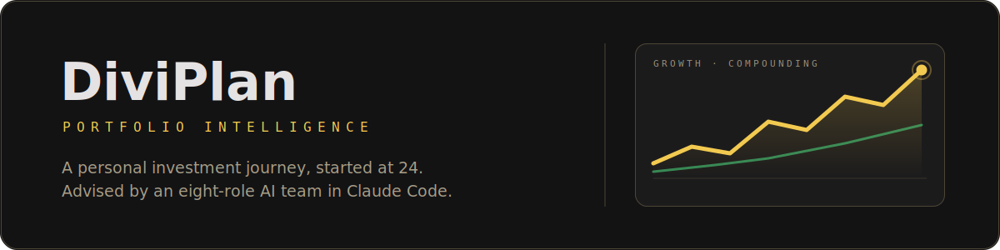

<p align="center">
  
</p>

<p align="center">
  <a href="https://riegodavid-git.github.io/diviplan/dashboard.html"><strong>🔴 Live dashboard</strong></a> ·
  <a href="#the-advisory-team">The AI team</a> ·
  <a href="#the-dashboard">Dashboard tour</a> ·
  <a href="#the-plan">The plan</a>
</p>

---

# What is this?

This is my **personal investment journey, started at age 24** — June 2026, the Philippines, ₱5,000 a week saved from half my allowance while I finish college.

It's also an experiment in how investing can work now: the entire "wealth management firm" runs **inside [Claude Code](https://claude.com/claude-code)**. No backend, no API keys, no app — just plain local files as the single source of truth, an AI advisory team that researches, audits, and challenges every decision, and a self-contained dashboard that regenerates after every cycle.

I'm not rich. The amounts are small. That's the point — what I'm building for the next ~18 months isn't a balance, it's a **system and a habit** that will run for 20+ years once my career starts. Every decision in this repo was researched, stress-tested, argued against, and only then written down.

> **This is not financial advice.** It's one person's documented journey with an AI advisor. The forecasts are scenarios, not predictions. Do your own research — watching how this repo does it is honestly half its value.

# The plan

**Plan 2.1 — "Max Growth, Trusted Optimizer"** (chosen after a fee audit killed Plan 2.0):

| Sleeve | Weight | Vehicle | Why |
|---|---|---|---|
| 🌍 Global equity | **88%** | **VT** (Vanguard Total World, ~9,900 stocks, 60+ countries) via GoTrade | The compounding engine. All-world and market-cap weighted, so it re-balances itself as the world changes — the same shape Norway's $2T sovereign fund holds. Custody verified: own-name account at a US FINRA/SIPC broker. |
| 🏢 PH REITs | **12%** | **AREIT** (offices/malls) + **CREIT** (solar) via DragonFi | The dividend journey: real quarterly peso income from buildings and solar farms, reinvested every time. Also a deliberate tilt toward the economy I live in. |

The routine: **₱5,000/week parked, invested once a month** (~₱17.6k → VT, ~₱2.4k → alternating REIT board lots), every dividend reinvested, no timing, no chasing, never sell the core. At graduation (~late 2027): contributions rise, VT migrates to VWRA via IBKR for tax efficiency, and the whole strategy gets re-run against a real salary.

Key decisions this system already caught:
- **The 1.5%/yr feeder-fund fee** the original plan would have paid — a slow ~₱3M leak over 21 years. Rerouted.
- **88/12 vs 100% VT** — simulated over 60 years: the gap is ~5% of final value, in exchange for ~35% more cash dividends along the way. I chose the dividends; they're what keep a 24-year-old motivated through the first crash.
- **"Buy the dip" vs monthly buys** — the data (Schwab's classic study) says scheduled buying beats waiting for dips, because cash waiting for red candles is the worst position of all.

# The advisory team

When I say **"run my update"**, eight AI roles run in fixed order, each with one job and one bias. The structure exists so that no single voice — including mine — goes unchallenged.

| | Agent | What it does |
|---|---|---|
|  | **SCOUT** · Research | Searches the live web every cycle: fees, broker news, regulatory changes. Includes the **Institutional Watch** — what Norway's GPFG, Japan's GPIF, and Berkshire are doing, why, and whether it matters here (usually it shouldn't, and it says so). |
|  | **KEEPER** · Portfolio | Reads the holdings file, computes every position's weight and drift vs target, flags anything more than 5pp off, and appends the value-history snapshot. |
|  | **SENTINEL** · Risk | Scores the portfolio 1–10 on concentration, volatility, currency exposure, and the higher-risk satellite — and compares it to last cycle. |
|  | **HORIZON** · Forecast | Projects the balance at ages 35 and 45 at 5/7/10% returns, always labeled *scenario, not prediction*, always splitting contributions from growth. |
|  | **TRANSLATOR** · Analyst | Turns research into 2–3 options for *this* portfolio — always including "do nothing" — with pros, cons, and a stated confidence. Never commands. |
|  | **LEDGER** · Tax | Philippine tax mechanics: the 10% dividend withholding, the 0.1% stock transaction tax, and the US estate-tax tripwire that schedules the IBKR migration. |
|  | **CONTRARIAN** · Critic | The designated devil's advocate. Builds the strongest case *against* everything above — blind spots, overconfidence, what the team wants to be true. |
|  | **THE DESK** · Summary | Merges it all into one dated digest — headline, changes, flags, conflicts side by side — and regenerates the dashboard. |

Outside of update cycles, the same system acts as a personal agent: I report a buy in plain chat ("bought 100 AREIT at ₱37.80 today") and the files and dashboard update; I share a life change and the forecast re-runs.

# The dashboard

**[→ Open the live dashboard](https://riegodavid-git.github.io/diviplan/dashboard.html)** — one self-contained HTML file, zero dependencies on a server, regenerated by THE DESK each cycle. Every section exists to answer a real decision I face:

- **Overview** — total value vs principal, the growth forecast with a what-if contribution slider (the single most motivating control: drag it and watch what ₱2,000 more a week does to age 45), allocation drift bars, and **The World You Own**: a ranked view of all 60+ countries inside VT plus a 1900→today chart of how world markets have shifted — the visual argument for why I hold the world instead of betting on one country.
- **🎓 Game Plan** — the phase timeline from first buy to graduation, with milestones. This is the habit tracker; the numbers matter less than the streak.
- **Income** — projected quarterly REIT income and the dividend log. The "is this working?" page: every payout that lands here and gets reinvested is the flywheel turning.
- **Investment Log** — every transaction with running totals; deployed vs out-of-pocket vs reinvested. Keeps me honest about what I actually did versus what I planned.
- **Risk** — SENTINEL's score plus the always-on known-risks list (rate sensitivity, platform friction, the US/AI concentration that even Norway's fund is warning about). I read this *before* adding any money to anything.
- **Tax** — withholding tracker and the PH rule cheat-sheet, including the estate-tax line that triggers the IBKR migration.
- **Research** — SCOUT's dated findings as cards, each rated Low/Med/High materiality. The paper trail for every decision above.
- **Profile** — read-only mirror of who I am and what I chose. Changes happen by talking to the advisor, never by editing the dashboard.

# How it works under the hood

```
profile.json            who I am, goals, target allocation
holdings.json           positions, transactions, dividends, value history
research_log.md         every SCOUT finding, dated and rated
college_game_plan.md    the routine until graduation
digests/                one dated digest per advisory cycle
dashboard.html          the whole UI, regenerated each cycle
CLAUDE.md               the constitution: roles, rules, hard limits
```

Plain files, no database. `CLAUDE.md` is the interesting one — it's the system prompt that turns a Claude Code session in this folder into the advisory team, with hard rules it cannot cross: *advise only, never execute trades; never store credentials; forecasts are scenarios; cite sources; always end with the disclaimer.*

# Milestones

- [x] Strategy chosen, audited, stress-tested (June 2026)
- [x] Feeder-fund fee trap caught and rerouted
- [x] GoTrade custody due-diligence passed (own-name SIPC account at Alpaca verified)
- [ ] First AREIT board lot
- [ ] First VT buy
- [ ] First dividend received and reinvested
- [ ] ₱100,000 portfolio
- [ ] Graduation: salary, IBKR, VWRA migration

---

<p align="center"><sub>Built with <a href="https://claude.com/claude-code">Claude Code</a> · Informational only — not licensed financial advice.</sub></p>
